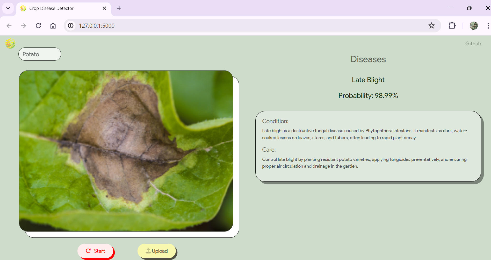
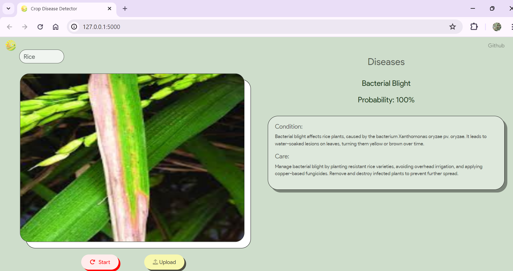
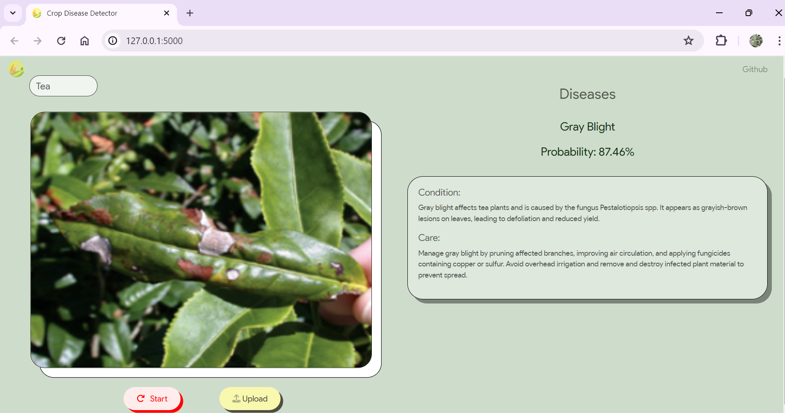

# Crop Disease Detection of Potato, Rice and Tea Crops using Custom CNN model, TensorFlow v2, Python, Flask, OpenCv2

<br/>
<div align="center">
    
    <h3 align="center">Crop Disease Detector</h3>
    <iframe width="420" height="315" src="https://www.youtube.com/watch?v=OMcqQ4xGDqY"></iframe>
</div>

## Setup using Python virtual environment

First we create the virtual environment and clone the repository into it. 
Then, we install all dependencies before running the application.

1. Clone the repo

```sh
git clone https://github.com/priyanka-maz/crop-disease
```

2. Create and activate virtual environment

```sh
cd crop-disease
python3 -m venv myvenv
myvenv\Scripts\activate
```

3. Install Requirements

```sh
python3 -m pip install -r requirements.txt
```

4. Run the application
```sh
python3 app.py
```

## Usage

- Permissions for video feed usage must be set to 'Allow',
- Select the crop whose disease you wish to detect under 'Select a crop'.
- Use the 'Upload' button to upload .jpg, .jpeg or .png files of crop of interest from the local file system.
- Use the 'Snap' button to click a photo in real-time for crop disease analysis.
- View the detected disease under the 'Diseases' section and its associated probability.
- View instructions for condition and care of the detected disease.
- Click the 'Start' button to re-start capturing real-time images

## Screenshots




## Features

- This website was developed using Python, Flask, SocketIO, HTML, CSS and Javascript.
- Flask has been utlized as a development server.
- SocketIO has been used to set up a bidirectional stream of images and their inference results between the client and server.
- Users who wish to click real-time images of their crops may use this application.
- Functionality for uploading pre-existing images and detecting crop disease in them has been implemented.
- Details about the detection disease condition and preventitive measures or care suggestions are displayed on the website for informing the user.

## File Structure

```
crop-disease
│   app.py ----------------------- Driver script for Flask application
│   README.md
│   requirements.txt ------------- Lists all requirements, libraries and dependencies
├───models------------------------ Contains all checkpoints for each of the crop disease models
│       models.py----------------- Functions for Inference using model checkpoints
├───static ----------------------- Contains javascript files, styling and static images
│   └───connection.js------------- Sends Socketio requests to server for crop image inference
├───templates--------------------- Contains all HTML templates deployed in the website
└───training---------------------- Contains ipynb files used to train models
```